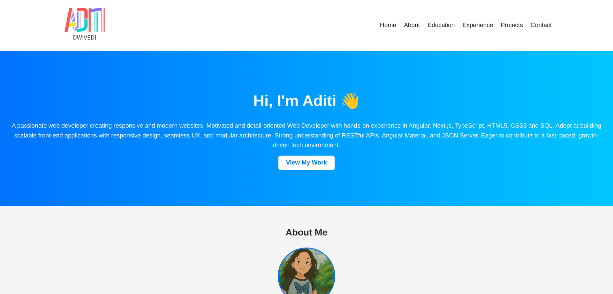
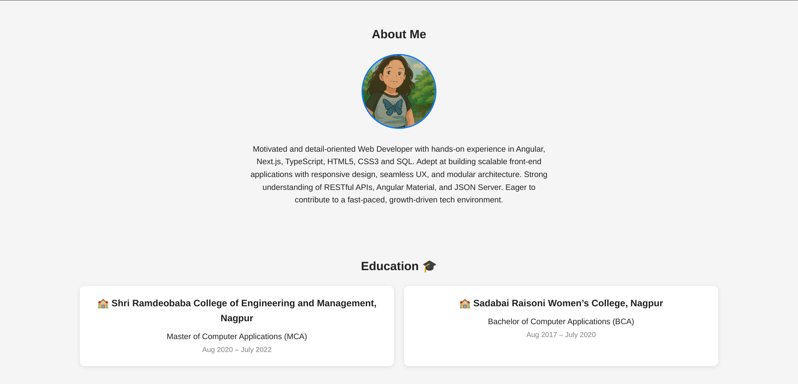
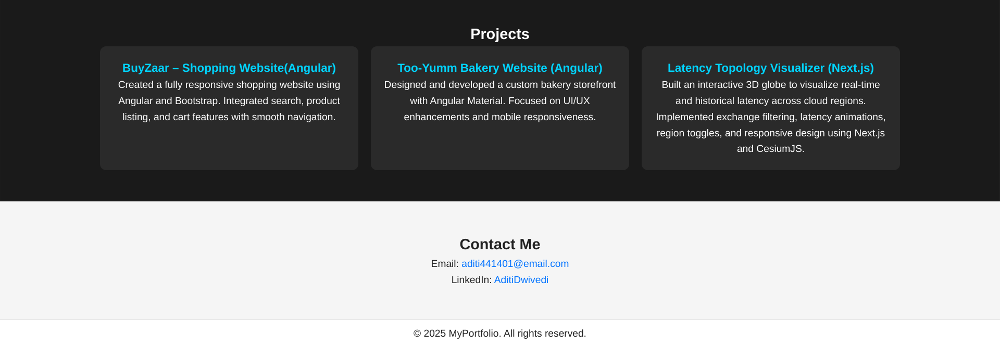
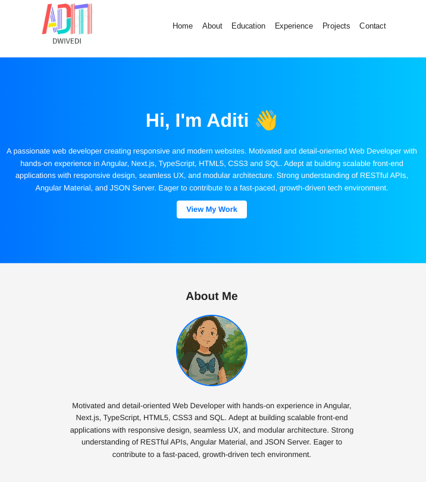

# Aditi Dwivedi - Portfolio Website

A responsive and professional personal portfolio website showcasing my skills, education, experience, and projects.  
This site is built with **HTML5** and **CSS3** and is hosted using **GitHub Pages**.

## 🌐 Live Demo
[View Portfolio](https://yourusername.github.io)

## 📌 Features
- **Responsive Design** – Mobile, tablet, and desktop friendly
- **Custom Logo** – Displays my personal `aditi-logo`
- **Hero Section** – Introduction with a call-to-action
- **About Section** – Profile photo and bio
- **Education Section** – Two cards with details, year, and emoji
- **Experience Section** – Responsive job/role cards
- **Projects Section** – Clickable project links
- **Contact Section** – Email and social links

## 📂 Folder Structure
.
├── index.html
├── style.css
├── script.js
├── images/
│   ├── aditi-logo.png
│   ├── me.jpg
├── screenshots/
│   ├── home.png
│   ├──teblet-view.png
└── README.md


## 🚀 Deployment
This site is hosted for free using **GitHub Pages**.

### Steps to Deploy:
1. Create a GitHub repo named:
 Aditi71.github.io

2. Clone the repo:
```bash
git clone https://github.com/Aditi71/aditiDwivedi-portfolio.git
```

3. Copy all files (index.html, style.css, images) into the repo folder.


4. Commit and push:
```bash
git add .
git commit -m "Initial portfolio upload"
git push origin main
```

5. Go to Settings → Pages in your repo and select:

Branch: main
Folder: / (root)


6. Wait 1–3 minutes and open:
 Aditi71.github.io


## 📸 Screenshots

### Home Page


### About and Education Section


### Experience Section


### Projects and Contact Section


### Tablet View


## 🛠 How to Update

Edit index.html to update text or add new sections.
Modify style.css for colors, fonts, and layout changes.
Push updates to main branch — the live site will update automatically.

## Technologies Used
HTML5
CSS3 (Flexbox, Grid, Media Queries)

## License
This project is licensed under the MIT License.
